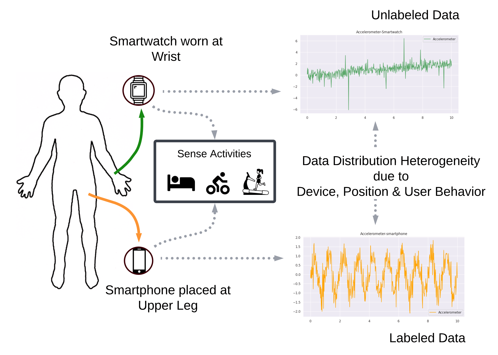
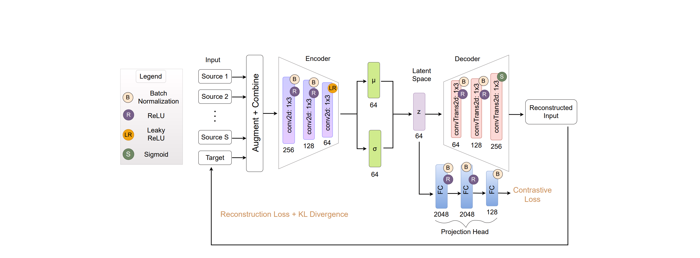
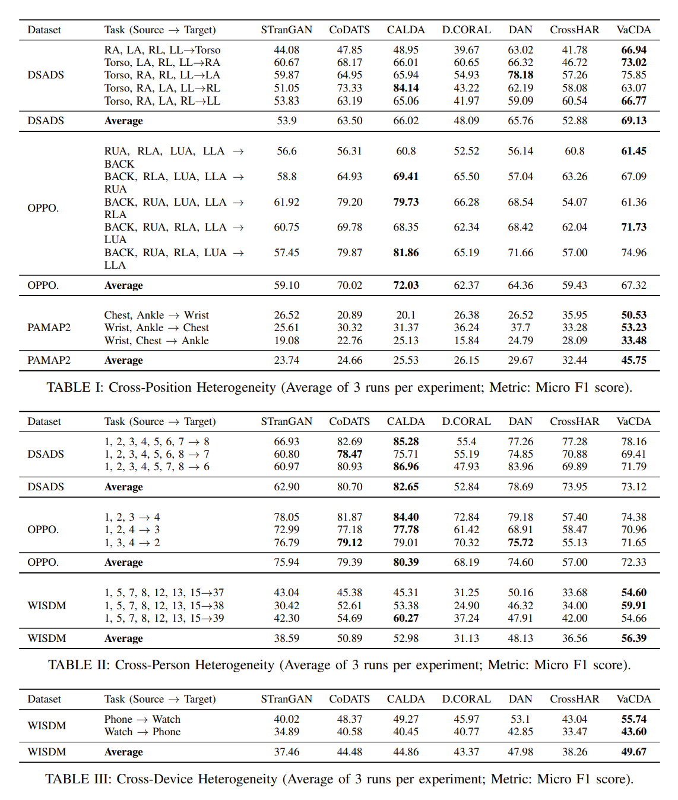

# Variational Contrastive Domain Adaptation
###### Khisa & Chakma, 2025
---
---
# Problem

<v-clicks depth="2">

- Data depends not only on its features, but how it's measured
  - Ex: Facial landmarks dependent on camera position
- Training data is carefully normalized for best learning performance
- Result: Inference performance on non-normalized data is poor
- (This class of problem is known as "domain adaptation")

</v-clicks>
---
---
# Model

<v-click>

- "Human activity recognition"

</v-click>
---
---
# Approaches: Statistical

<v-clicks depth="2">

- Lemma: There exist transformations that...
	- ...preserve dataset features
	- ...embed data distributions using a parameter which forms a *Hilbert space*
	- ...***but*** reduce statistical discrepancy between source and target datasets
- Left as an exercise to the reader
- Result: Direct application of source classification to target data after transformation into this space tends to be relatively successful

</v-clicks>

---
---

# Approaches: Adversarial

<v-clicks>

- Propose a model for a transformation directly from target to source
- Learn a transformation against an adversary
- Transform target to source and classify with a source classifier

</v-clicks>

---
---

# Approaches: Variational Autoencoding

<v-clicks>

- Principle: If the datasets have the same features, they embed into the same latent space
- Train variational autoencoder
- Combine with another method (historically, an adversary) to provide ground truth for encoding target space
- A classifier on data run through the autoencoder performs adequately on target data

</v-clicks>

---
---

# Approaches: Contrastive learning

<v-clicks depth="2">

- *Augment* data points using transformations we expect the model to be robust to
- Train model to classify augmented points as similar if they're augmentations of the same point...
- ...and different...
  - Supervised: ...if they're different points from the source
  - Unsupervised: ...based on the assumption that in a healthy dataset most pairs are different

</v-clicks>

---
---

# Variational Contrastive Domain Adaptation

<v-clicks depth="2">

- Simultaneously train a variational autoencoder for...
  - Encoding quality
  - Supervised contrastive loss
  - Unsupervised contrastive loss
- Big idea: VAE, but if the latent space is no good for contrastive inference, it's no good for classification
- Classify the latent space

</v-clicks>

---
---

---
---

# Applications

<v-clicks depth="2">

- If it has "cross-" in the name, it's a viable approach:
	- Cross-position emotion inference
	- Cross-device emotion inference
	- Cross-culture emotion inference
	- Cross-person engagement inference
	- You get the idea...

</v-clicks>

---
---

# Caveats

<v-clicks depth="2">

- Requires online learning to be feasible
	- Has been demonstrated, this is about device constraints
- Unfortunately, sometimes an F1 score of 0.5 is considered "good"

</v-clicks>

---
---

# Case summary

<ul>
<li v-click="1">Applicability: Most of our anticipated inference tasks</li>
<li v-click="2">Costs: Not exorbitant, but probably not cost-effective over-the-wire</li>
<li v-click="3">Implementation concerns: Some challenges for the low-end devices if targetting on-device</li>
<li v-click="4">Required R&D: Must be proven out for any given inference problem; may not work for some</li>
<li v-click="5">Outlook: Reserved optimism at best</li>
</ul>

 

# **Verdict: Shelve for awhile**

